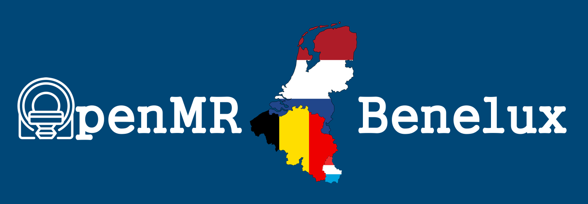
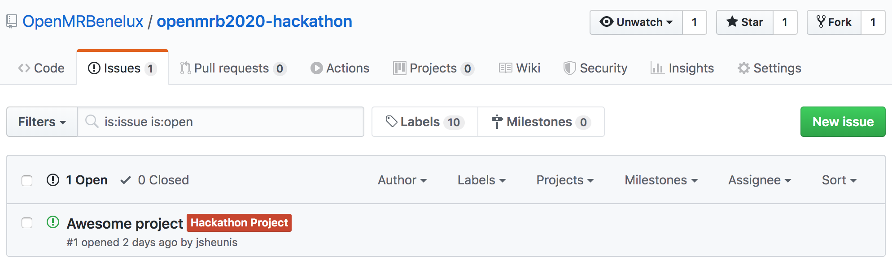
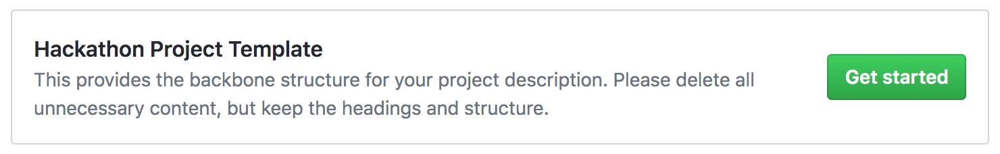
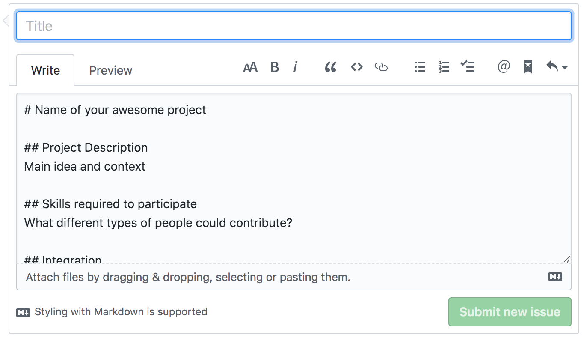

# OpenMR Benelux 2020 Hackathon 

## Let's get started!

This repository hosts the hackathon projects and communication related to the HackTrack of [OpenMR Benelux 2020](https://openmrbenelux.github.io/page-openmrb-2020/). Visit our website if you want to learn more about OpenMR Benelux, or register now if you want to join!

In order to take part in the HackTrack, you will first have to register for the event. After that, you can suggest a project to lead at OpenMR Benelux 2020, or join a project that has already been suggested.

## Suggest a project

Projects are created as `issues` on this GitHub repository to allow for a sensible workflow of project description and communication. For a good example of how this has worked in the past, see the list of projects for the recent [OHBM Hackathon](https://github.com/ohbm/hackathon2019/issues?page=2&q=is%3Aissue+is%3Aopen).

First, select the `Issue` tab and then click on `New Issue`.

Then, select `Get Started` in the `Hackathon Project Template` section.

Finally, create a project title, replace the template content with the specifics of your own project, and click on `Submit new issue`.

Next, get cracking!

## Questions?

If you are still uncertain about this process or have any other questions, please create a new (no template) issue. We'll do our best to respond as quickly as possible.

