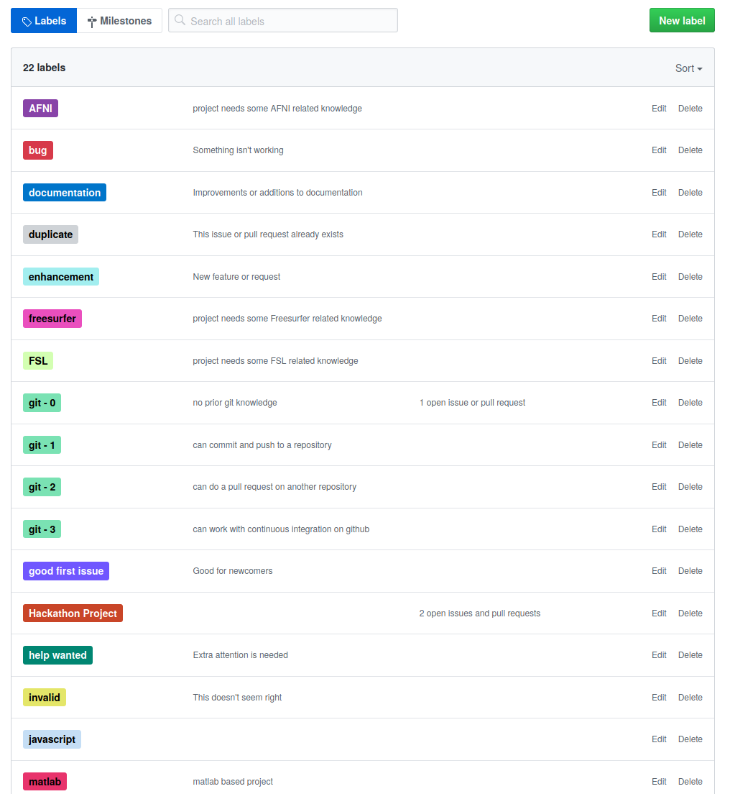

<!-- TOC -->

- [OpenMR Benelux 2020 Hackathon](#openmr-benelux-2020-hackathon)
  - [What is a hackathon?](#what-is-a-hackathon)
  - [What kind of projects can you find in a hackathon?](#what-kind-of-projects-can-you-find-in-a-hackathon)
  - [Suggest a project](#suggest-a-project)
    - [Using github issues to create a projet](#using-github-issues-to-create-a-projet)
      - [Label your project](#label-your-project)
  - [Tips to run a successful hackathon](#tips-to-run-a-successful-hackathon)
  - [Questions?](#questions)

<!-- /TOC -->

# OpenMR Benelux 2020 Hackathon

This repository hosts the hackathon projects and communication related to the HackTrack of [OpenMR Benelux 2020](https://openmrbenelux.github.io/page-openmrb-2020/). Visit our website if you want to learn more about OpenMR Benelux, or register now if you want to join!

In order to take part in the HackTrack, you will first have to register for the event. After that, you can suggest a project to lead at OpenMR Benelux 2020, or join a project that has already been suggested.

At the beginning of our event, all project leaders will briefly describe their project to recruit team members.
If you are interested in a certain project, you can approach these project leaders afterwards and express your interest in participating.
At the end of the openMR event, there will be wrap up of each project with a short presentation to inform attendees about the project progress and future tasks to be done.

## What is a hackathon?

The word `hackathon` can be split into "hacking" and "marathon”.

A <i>hackathon</i> can then be defined as an event in which you can intensively (that's the **marathon** part) and collaboratively work (that's the **hacking** part) on a common project. Hackathons are different than the typical academic conference sessions because individuals will be actively trying to accomplish something rather than merely attending. As a rule of thumb, think of hackathon attendees as saying "I am here to help" and of a hackathon leader being able to tell them "here's what you can do to help."

**Although many hackathon projects might involve coding, it is not necessarily the case and many projects can be done using only google docs for example.**

After the hackathon, you can keep collaborating to finish the project and even decide to publish it depending on the predefined goals.

## What kind of projects can you find in a hackathon?

The projects can be things the project leader is already working on, or a project they would like to receive contribution/opinion/help, or a completely new project they would like to accomplish with group work.

You can find example of projects listed in the different [brainhack events](http://www.brainhack.org/) or directly on the websites of previous hackathons :

- [BrainHack Ghent 2018](https://brainhackghent.github.io)
- [OHBM 2019 hackathon](https://github.com/ohbm/hackathon2019/issues)
- [Brainhack Princeton 2019](https://github.com/brainhack-princeton/brainhack-princeton-2019)
- [Brainhack Open Geneva 2020]("https://brainhack.ch/#portfolio)
- ...

If this is not enough, here are some projects that you could propose:
- improving existing materials to comparing certain methods or creating packages
- creating youtube videos to present your favorite tool or some of its feature
- help improve the online documentation of some software (like the [SPM wikibook](https://en.wikibooks.org/wiki/SPM))
- ...

## Suggesting or joining a project

When you propose a project make sure that it has a rough plan about the amount of work that needs to be done and that it has clear goals that can be (partly) achieved during the (short) amount of time you are provided with.

Since you won’t have any knowledge about the expertise profile of the other Brainhack attendees until the hackathon starts, it is better to incorporate some flexibility into your project plan and schedule. Because there is always a possibility of getting help from any number of attendees on many different aspects of your project that you didn’t plan ahead. Please do not undermine the contribution that would come from any of the attendees at the event. This is one of the important parts of the event. Be inclusive and open to the contributions. Especially if they come from an early career researcher and he/she is there to learn from you; please do not forget that you were one of them once too and that providing people with an environment to learn and improve themselves is one of the main goals and gains of the event. And again you would never be able to know which contribution an attendee could provide you with. Therefore, it is always better to keep yourself open to different ideas and contributions and to let the brainstorming help you achieve your project’s goals.

We explain below how to to propose your own project idea, but you're not sure whether or how to work it out to a full project, please get in touch using our [Contact Page](https://openmrbenelux.github.io/page-contact/) and we're happy to help you out!

### Using github issues to create a projet

Projects are created as `issues` on this GitHub repository to allow for a sensible workflow of project description and communication. For a good example of how this has worked in the past, see the list of projects for the recent [OHBM Hackathon](https://github.com/ohbm/hackathon2019/issues?page=2&q=is%3Aissue+is%3Aopen).

First, select the `Issue` tab and then click on `New Issue`.

Then, select `Get Started` in the `Hackathon Project Template` section.

Finally, create a project title, replace the template content with the specifics of your own project, and click on `Submit new issue`.

#### Label your project

We have designed a [list of issue labels](https://github.com/OpenMRBenelux/openmrb2020-hackathon/labels) so that attendees can quickly identify projects that might match their interest and skill levels.

Make good use of those labels and you tag your project appropriately.

## Tips to run a successful hackathon

- Be sure to thank people who attend your hackathon! These are the people who are interested in helping.
- Don’t assume people in the room know more, or less, than you do. You never know who is going to be interested in your session.
- A great way to start a session is to ask attendees to say why they came to your session or what special skills they have that could be helpful. This can help you steer the session to be helpful to them and gives you an idea of the resources/skills you have in the room!
- Another good early activity is "whiteboard time": Working out the scope of the project, mapping out the units of the project, and identifying how these units will integrate.
- Remind people that if they want to swap groups/ leave the room to do something else that's ok and encouraged. This is all about getting the most out of people's enthusiasm and having people feel like they have no choice but to stay can kill that.
- It can be hard to know how many people will attend each session and what their skills are. To plan for this uncertainty, you may want to prioritize the things the hackathon is trying to accomplish.
- If you have a large group, break the group down and divide the project into units, and have people elect to work on different components. If you have a smaller group, you can focus on the top priorities.
- Think about the flow of information and how attendees can share their work with one another.
- When you break out into groups, it is often a few teams spread around the room working on laptops. Using tools like OSF, google documents, github, Slack, etc. can be useful.
- Consider getting contact information of people who want to continue the work after SIPS. Sometimes a hackathon can be used as a few hours of in-person planning for work that a few people will do over the course of a longer period of time. You may find a group of dedicated people who will do some follow-up work to your hackathon.
- Before your hackathon disbands, try to organize any materials that you want to share with others. This might be as simple as assigning somebody to organize an OSF project.
- If things stall, get a group together and talk through the issues. Drawing diagrams, and talking through what you’re trying to achieve is an important process in identifying roadblocks and how to avoid/resolve them.
- Have a “deliverable” in mind, what is the thing you can say you’ve made (or at least made progress on) at the end of the hackathon?

## Questions?

If you are still uncertain about this process or have any other questions, please create a new (no template) issue. We'll do our best to respond as quickly as possible.
